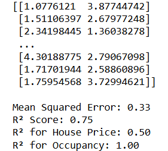

# SGD-Regressor-for-Multivariate-Linear-Regression

## AIM:
To write a program to predict the price of the house and number of occupants in the house with SGD regressor.

## Equipments Required:
1. Hardware – PCs
2. Anaconda – Python 3.7 Installation / Jupyter notebook

## Algorithm
1. Data Preparation: Load the California housing dataset, extract features (first three columns) and targets (target variable and sixth column), and split the data into training and testing sets.
2. Data Scaling: Standardize the feature and target data using StandardScaler to enhance model performance.
3. Model Training: Create a multi-output regression model with SGDRegressor and fit it to the training data.
4. Prediction and Evaluation: Predict values for the test set using the trained model, calculate the mean squared error, and print the predictions along with the squared error.

## Program:
```
import numpy as np
from sklearn.datasets import fetch_california_housing
from sklearn.model_selection import train_test_split
from sklearn.preprocessing import StandardScaler
from sklearn.linear_model import SGDRegressor
from sklearn.multioutput import MultiOutputRegressor
from sklearn.metrics import mean_squared_error, r2_score

data = fetch_california_housing()

X = data.data[:, [0, 1, 2, 5, 7]]  # Features: MedInc, HouseAge, AveRooms, AveOccup, Population
y = np.column_stack((data.target, data.data[:, 5]))  # Target: House Price, Occupancy

X_train, X_test, y_train, y_test = train_test_split(X, y, test_size=0.2, random_state=42)

scaler = StandardScaler()
X_train_scaled = scaler.fit_transform(X_train)
X_test_scaled = scaler.transform(X_test)

sgd = SGDRegressor(max_iter=1000, tol=1e-3)
multi_output_sgd = MultiOutputRegressor(sgd)
multi_output_sgd.fit(X_train_scaled, y_train)

y_pred = multi_output_sgd.predict(X_test_scaled)

mse = mean_squared_error(y_test, y_pred)
r2 = r2_score(y_test, y_pred)

print(y_pred)
print()
print(f"Mean Squared Error: {mse:.2f}")
print(f"R² Score: {r2:.2f}")

r2_house_price = r2_score(y_test[:, 0], y_pred[:, 0])
r2_occupancy = r2_score(y_test[:, 1], y_pred[:, 1])

print(f"R² for House Price: {r2_house_price:.2f}")
print(f"R² for Occupancy: {r2_occupancy:.2f}")

```

## Output:
```
[[1.0776121  3.87744742]
 [1.51106397 2.67977248]
 [2.34198445 1.36038278]
 ...
 [4.30188775 2.79067098]
 [1.71701944 2.58860896]
 [1.75954568 3.72994621]]

Mean Squared Error: 0.33
R² Score: 0.75
R² for House Price: 0.50
R² for Occupancy: 1.00
```



## Result:
Thus the program to implement the multivariate linear regression model for predicting the price of the house and number of occupants in the house with SGD regressor is written and verified using python programming.
